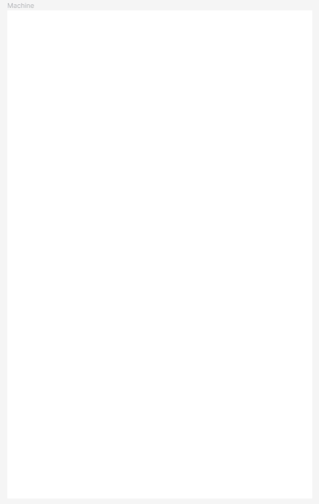

# Pincrediball Prototype 007

The seventh prototype, published purely for entertainment purposes.
This repository will likely not get further updates.

Check out [the pincrediball.com devlog](https://www.pincrediball.com/devlog) for more in-depth updates about development.

## Screenshot

### Day 22 status

Here's the status after [Day 22](https://www.pincrediball.com/devlog#post-2023-03-06):

### Day 23 status

And a snapshot of the build-up of designs after [Day 23](https://www.pincrediball.com/devlog#post-2023-03-07):

### Day 24 version of Prototype 007

Here's the status after [Day 24](https://www.pincrediball.com/devlog#post-2023-03-08):

### Day 26 version of Prototype 007

Here's the status after [Day 26](https://www.pincrediball.com/devlog#post-2023-03-10):

### Further development

The code in this prototype is promising and useful.
So work will continue in this repository for now.
Check the tags of this repository for older states.
